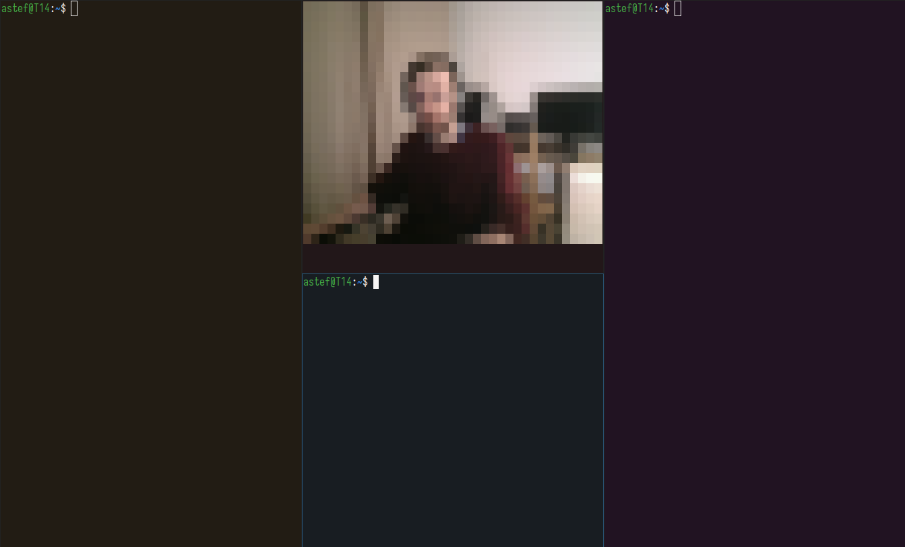

# Prerequisites

- Install GoCV, full instruction [here](https://gocv.io/getting-started/linux/):

```
go get -u -d gocv.io/x/gocv
```

`$GOPATH` may be not set, but the rest of the path is fine (search for the right path on your system):

```
cd $GOPATH/src/gocv.io/x/gocv
```

This takes a few minutes:

```
make install
```

 - Ensure your terminal support 24-bit colors, you can use `tools/` for testing

# Usage

`go build . && ./termcam 0`
 - Replace `0` with the index of your video device (usually, from 0 to 6), or with a full path to it

 

# Features
 - Picture size and quality adjust to your terminal size
 - '▀' (Unicode 0x2580) is used to maximize vertical resolution, but any other symbol can be used (check in source code)

# Limitations
 - It's video rendering in terminal - entire screen is refilled 33 times a second, so it may be slow
 - Looks like there's no good way to avoid extra line below the picture, otherwise scrolling happens
 - Periodically I'm receiving empty frames from my devices (tested with two cameras): see `error reading from webcam: empty frame`. You may want to remove the line, which prints this error to avoid flickering. I've left it for diagnostic purposes.
